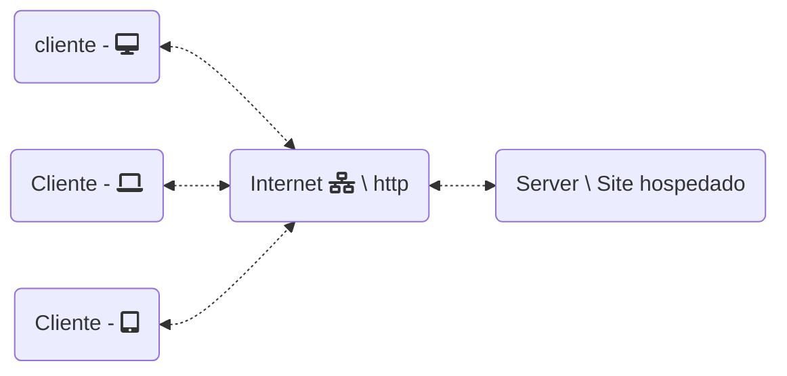
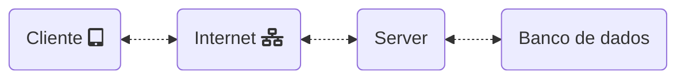

# HISTÓRIA DA WEB

## Primeiros Computadores

### 1ª Geração
 - Harvard Mark I (1944): computador eletromecânico baseado em válvulas, era basicamente uma máquina de calcular;

 - Colossus (1946): criado para cálculos e criptoanálise na Alemanha;

 - ENIAC (1946): em contrapartida ao Colossus, os EUA tinham o ENIAC, que era mais automatizado que os outros computadores;

 - Nesta época de 1946, surgiu o termo "bug", pois a temperatura dos computadores era alta, atraindo insetos.

### 2ª Geração (1959 - 1965)
 - Evolução das válvulas para os transistores; esta evolução causou a diminuição do tamanho dos computadores.

### 3ª Geração (1965 - 1970)
 - Desenvolvimento dos circuitos integrados (chips) que diminuíram ainda mais os computadores.

### 4ª Geração (a partir de 1971)
 - Evolução dos circuitos e surgimento e popularização dos PCs (Personal Computers).

### 5ª Geração
 - IA (Inteligência Artificial), Metaverso, Computadores Quânticos e Bitcoin.

## Internet como surgiu
A internet e os computadores evoluíram de forma paralela; podemos dizer que a internet está ligada principalmente à comunicação. 

Um dos principais instrumentos de comunicação foi o telégrafo, que usava código morse como forma de transmitir uma mensagem.

Na década de 50, no período da Guerra Fria, a disputa entre **USA** e **URSS** causou a explosão da tecnologia. Desse período surgiu a DARPA (Defense Advanced Research Projects Agency), que tinha por objetivo manter a superioridade tecnológica dos EUA.

Joseph Carl Robnett Licklider "plantou" a semente na DARPA ao teorizar sobre uma rede de computadores se comunicando em diferentes localizações.

Depois de alguns avanços e evoluções, surgiu a ARPANET (Advanced Research Projects Agency Network), que era um sistema de comunicação em pacotes. A primeira conexão aconteceu em 1969, que foi uma comunicação entre a UCL (University of California) e o SRI (Stanford Research Institute); a mensagem era **LOGIN**, mas o que chegou do outro lado foi **LO**.

A ARPANET evoluiu e ganhou outros pontos (nós), e Vinton Cerf e Robert Kahn criaram o protocolo TCP/IP, o que deu mais robustez e deu origem a microredes especializadas.

Em 1989, Tim Berners-Lee uniu o TCP/IP e hipertexto para desenvolver a WWW (World Wide Web), e o primeiro site foi o "info.cern.ch".

## Grandes Nomes
- Grace Murray Hopper: Foi uma das primeiras programadoras do Mark I, criou a linguagem de alto nível Flow-Matic (base do COBOL) e deu origem ao termo "bug".

- Joseph Carl Robnett Licklider: Teorizou sobre uma rede de computadores e, por esta teoria, foi recrutado pela DARPA. Plantou a semente da comunicação dando a ideia de conectar dois computadores em pontos distintos.

- Robert E. Kahn: Junto de Vinton Cerf, criou o TCP/IP e ainda apresentou o primeiro e-mail.

- Tim Berners-Lee: Foi o inventor da WWW (World Wide Web), diretor do WWW Consortium, popularizou o HTTP e o HTML.

- Marc Andreessen: Reinventou o navegador com o Netscape baseado no Mosaic e tornou o navegador amigável com recursos gráficos.

- Bill Gates: Fundador da Microsoft, a equipe da Microsoft desenvolveu o navegador Explorer que tornou a internet acessível a todos os computadores.

- Steve Jobs: Fundador da Apple, popularizou o smartphone que conhecemos hoje.

# O QUE SÃO CLIENTES

## Cliente na Web

O cliente é o dispositivo que está comunicando uma informação da internet, a qual está presente em outro computador (Servidor). O cliente vai para a internet, que busca arquivos como HTML, CSS, JavaScript, imagens, entre outros, no servidor que retorna ao cliente os arquivos que ficam armazenados na máquina na forma de cache. Os usuários utilizam uma grande quantidade de dispositivos que possuem tamanhos diferentes, o que torna importante levar em consideração o desenvolvimento de um design responsivo. Outro ponto para levar em consideração é a compatibilidade entre navegadores.

## Navegadores

Os navegadores ou browsers são softwares gratuitos que seguem os padrões W3C, mas possuem cada qual suas próprias particularidades. Tiveram início com o Mosaic, que passou para Netacape e hoje possuímos uma ampla variedade.

## Aplicação web

As aplicações são as aplicações que usam da internet como meio de comunicação ClienteXServer e não precisam de instalação. Os softwares que são instalados e os que não são instalados são diferentes, mesmo que ambos operem de forma igual; eles são de "mundos diferentes".

## Dispositivos Móveis

Atualmente os dispositivos móveis como *Celulares, Laptop, Smartwatch* são extremamente populares e os usuários tem uma média de tempo utilizando estes dispositivoss elevada.

